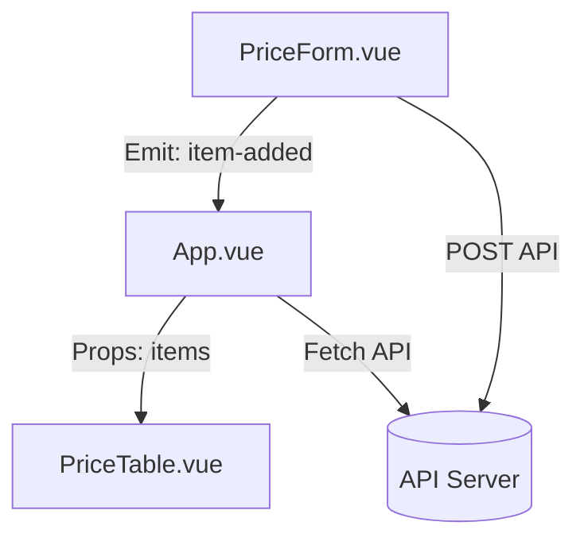

# 🥤 肥宅快樂水：可樂歷年價格查詢系統 (Vue 3 版本)

這個專案是將傳統的 HTML/JavaScript 系統改進並重構成 Vue 3 單文件元件 (SFC) 的版本。它提供了一個直覺的介面來記錄並查詢歷年可樂的價格變化。

---

## 🏗️ 元件介紹

專案採用元件化開發，主要分為以下三個核心部分：

### 1. [src/App.vue](src/App.vue) (主頁面元件)
- **職責**：頂層狀態管理與資料協調。
- **功能**：
  - 初始化時向 API (`/api/quotes`) 抓取所有資料。
  - 管理核心資料狀態 `allData`。
  - 協調 `PriceForm` 通過事件通知 (`item-added`) 來更新資料。

### 2. [src/components/PriceForm.vue](src/components/PriceForm.vue) (新增資料元件)
- **職責**：處理使用者輸入與資料提交。
- **功能**：
  - 使用 `reactive` 管理表單狀態（日期、名稱、價格）。
  - 自動處理表單驗證與 API 提交 (`/api/insert`)。
  - 提交成功後，透過 `emit` 通知父元件重新抓取資料。

### 3. [src/components/PriceTable.vue](src/components/PriceTable.vue) (資料顯示與查詢元件)
- **職責**：展示資料列表與提供搜尋功能。
- **功能**：
  - 接收來自父元件的 `items` 屬性。
  - 內建搜尋過濾邏輯（使用 `computed` 屬性實現即時篩選）。
  - 自動處理無資料時的顯示狀態。

---

## 🧩 如何構成網站？

本專案遵循 **「資料下行 (Props Down)，事件上行 (Events Up)」** 的 Vue 開發模式：



1.  **資料分發**：`App.vue` 作為單一資料源。它從後端 API 取得資料後，透過 `props` 傳遞給 `PriceTable.vue` 進行顯示。
2.  **互動回饋**：當使用者在 `PriceForm.vue` 中新增一筆資料並成功儲存後，它會發送一個自定義事件。
3.  **狀態同步**：`App.vue` 監聽到該事件後，會執行重新獲取資料的動作，進而自動觸發所有子元件的內容更新。

---

## 🛠️ 開發與部署

### API 依賴
專案預期後端提供以下兩個 API 節點：
- `GET /api/quotes`: 回傳所有價格物件的陣列。
- `GET /api/insert?date=...&product_name=...&price=...`: 新增一筆資料。

### 快速開始
1.  **安裝依賴**：
    ```bash
    npm install
    ```
2.  **啟動開發伺服器**：
    ```bash
    npm run dev
    ```
3.  **建構生產版本**：
    ```bash
    npm run build
    ```

---

## 📝 技術細節
- **框架**: Vue 3 (Composition API)
- **語言**: TypeScript
- **建構工具**: Vite
- **狀態管理**: Vue `ref` / `reactive` (無需 Vuex/Pinia 即可處理目前規模)

